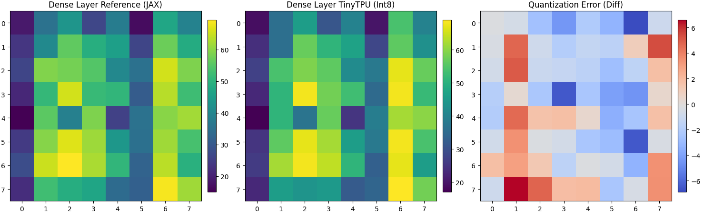

# TinyTPU: A simple JAX simulator

This notebook implements a simple cycle-accurate TPU simulation. The main goal is to illustrate how simple high-level JAX code can get executed with low-level systolic hardware. 

It uses eager execution (interpreting operations one-by-one) rather than XLA-style graph compilation.

**Architecture**

*   Frontend (Interpreter): Intercepts JAX calls (dot, add, relu) at runtime and dispatches them immediately to the simulator.
*   Middleware (Tiling): Slices large matrices to fit the hardware grid and handles data skewing required for systolic data flow.
*   Backend (Hardware Model): Simulates a Systolic Array (weight-stationary) for matrix math and a Vector Unit for element-wise ops.
*   Quantization: Rounds inputs to Int8 before computation to model realistic hardware precision loss.

**Usage**: Run the cells sequentially. The final demo executes a complete Dense Layer ($Y = \text{ReLU}(X \cdot W + B)$) on the simulator and visualizes the quantization error relative to the FP32 reference.

